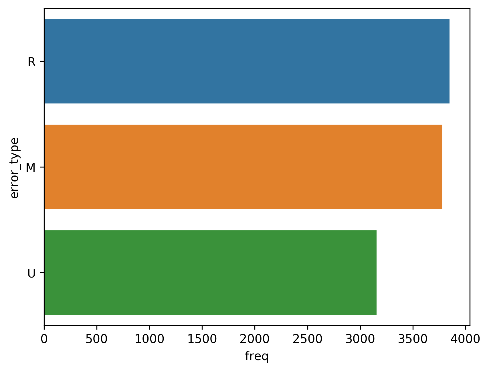
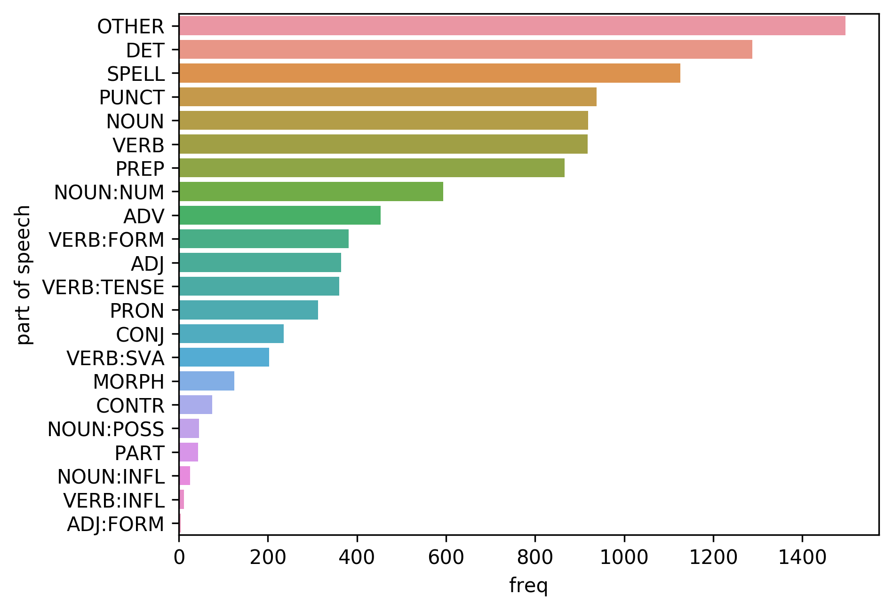

# m2_related
ここでのm2ファイルは，errantを用いて作成したものを想定．

##### extract_orig_for_m2.py

原文だけ抽出（特に使わなさそう）

* `-input <file_path>`：入力ファイルの指定

##### survey_statistics.py

コーパスの文数，単語数を調べる．結果はターミナル上に．

* `-input <file_path>`：入力ファイルの指定

* `-error_type <image_path>`：置換（R），挿入（M），削除（U)の頻度をグラフ化する．グラフは画像として出力．

  

* `-error_pos <image_path>`：誤りが関係する品詞の頻度をグラフ化する．グラフは画像として出力．

  

